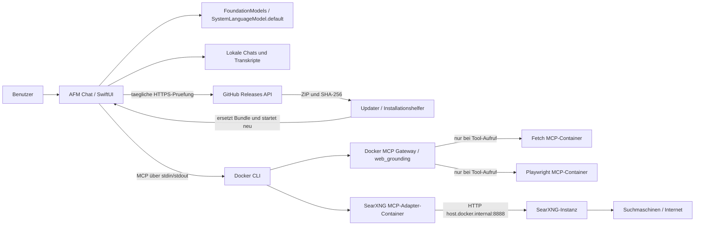

# Architektur und Datenfluss

AFM Chat ist eine native SwiftUI-App für macOS. Das Modell wird über Apples `FoundationModels`-Framework aufgerufen. Docker ist ausschliesslich für optionale Web-Recherche erforderlich.

## Komponenten

### Chat und Modell

- Die Chat-Ansicht nutzt `LanguageModelSession` für Folgefragen im selben Gespräch.
- Ein frei editierbarer System-Prompt in den Einstellungen gibt das grundlegende Verhalten vor. Er wird lokal in `UserDefaults` gespeichert und beim Erzeugen jeder neuen Modellanfrage verwendet. Der System-Prompt gilt auch für neue Nachrichten in bestehenden Chats.
- Die App prüft `SystemLanguageModel.default.availability` und zeigt `SystemLanguageModel.default.variant.displayName` an.
- Die App fordert keinen Modellnamen an und erzwingt nicht Advanced. macOS stellt die Standardvariante bereit.

### Projekte

- Projekte speichern Namen, Projekt-Prompt und Dokumentmetadaten. Gespeicherte Chats koennen ueber eine optionale `projectID` einem Projekt zugeordnet werden; alte Chats ohne dieses Feld werden als allgemeine Chats geladen.
- Projekttexte und lokale Vision-Analysen liegen unter `~/Library/Application Support/FMChat/Projects`. Originaldateien werden nicht dauerhaft kopiert.
- Die Suche ist rein lokal und lexikalisch: Text wird in Abschnitte zerlegt und mit BM25 anhand gemeinsamer Stichwoerter bewertet. Es werden hoechstens vier passende Abschnitte und ein begrenztes Zeichenbudget an das Modell uebergeben. Embeddings oder semantische Suche gibt es nicht.
- PDF-Abschnitte behalten den Dateinamen und, wenn vorhanden, die Seitenzahl. Projekt-Prompts werden als sessionspezifische Instructions kombiniert; globale Einstellungen bleiben davon getrennt.

### Dateien

- PDFs und Text-/Quelldateien werden lokal eingelesen; die daraus gewonnenen Inhalte werden in den Chat-Kontext aufgenommen.
- Bilder werden lokal mit Vision analysiert. Die App nutzt Analyseergebnisse im Chat statt die unverarbeiteten Bilddateien an einen Webdienst zu senden.
- Uploads werden vorübergehend im ausgewählten Arbeitsverzeichnis abgelegt und nach der Verarbeitung entfernt. Der Chat kann extrahierten Text oder Analysehinweise enthalten.

### Web-Grounding

- `MCPServiceManager` startet den Docker-MCP-Gateway-Prozess und den SearXNG-MCP-Adapter als Kindprozesse.
- Der Gateway verwendet das Profil `web_grounding`. Fetch und Playwright werden im Gateway bereitgestellt und von Docker MCP bei einem passenden Aufruf gestartet.
- SearXNG läuft als eigene Webinstanz. Der MCP-Adapter erreicht sie aus seinem Container über `host.docker.internal:8888`.
- App-seitig sind nur Such-, Fetch- und definierte lesende Browser-Tools freigegeben. Playwright-Klicks, Formularaktionen und Seitenänderungen werden nicht angeboten.

## Updates

- Der Updater prueft beim Start und danach taeglich, ob ein neueres stabiles GitHub-Release verfuegbar ist.
- Vor dem Entpacken wird die Groesse und der SHA-256-Digest gegen die GitHub-Release-Metadaten geprueft. Das entpackte Bundle muss die AFM-Chat-Bundle-ID und die zum Tag passende Versionsnummer haben.
- Zum Austausch startet die App einen kleinen lokalen Helfer, beendet sich und wird nach dem Austausch neu gestartet. Der Speicherort der `.app` muss fuer den angemeldeten Benutzer beschreibbar sein.

## Gespeicherte Daten

- Chatverlauf und Foundation-Models-Transkript: `~/Library/Application Support/FMChat/conversations.json`.
- App-Einstellungen und der System-Prompt werden lokal in `UserDefaults` gespeichert.
- Der sichtbare App- und Xcode-Projektname ist `AFM Chat`. Historische interne Bezeichner wie Bundle-ID, UserDefaults-Schlüssel und Chat-Speicherpfad enthalten weiterhin `FMChat`, damit bestehende Installationen und Daten erhalten bleiben.
